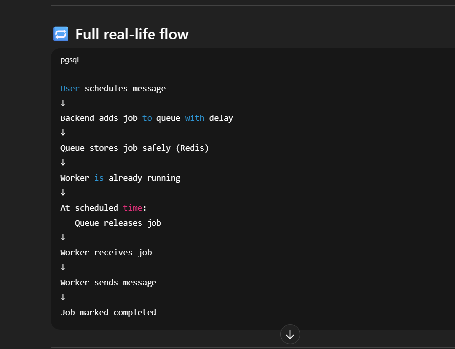
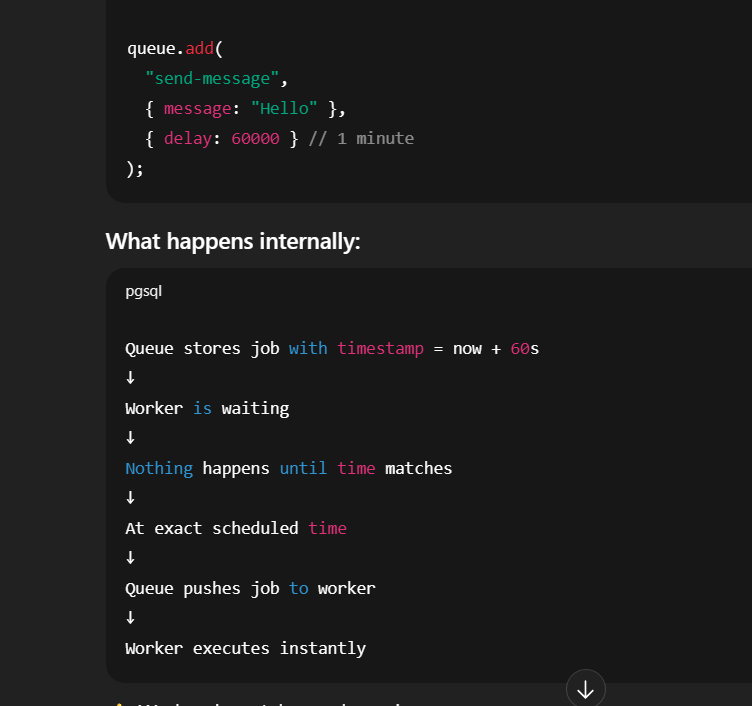

when the queue will run..


it schedule the message and time .. whenever the time matches it will execute or schedule the message..

❌ Problems with raw Redis queue

If you use Redis directly:

❌ no retries

❌ no delay

❌ no job states

❌ no failure tracking

❌ no concurrency control

❌ no crash recovery

❌ no locking

❌ duplicate execution possible

You must implement EVERYTHING yourself.

This is dangerous in production.

🔥 BullMQ (real system)

BullMQ is a full job queue system built on Redis.

It already implements:

✅ delayed jobs
✅ retries
✅ exponential backoff
✅ job states
✅ failure tracking
✅ job locking
✅ concurrency
✅ worker crash recovery
✅ rate limiting
✅ repeatable jobs

⚖️ Side-by-side comparison
Feature Raw Redis Queue BullMQ
Uses Redis ✅ ✅
Job push/pop ✅ ✅
Delay jobs ❌ ✅
Retry ❌ ✅
Backoff ❌ ✅
Job states ❌ ✅
Failed jobs ❌ ✅
Worker locking ❌ ✅
Crash recovery ❌ ✅
Concurrency ❌ ✅
Production ready ❌ ✅

🧠 Simple analogy
Raw Redis queue

“Manual gearbox car”

You must handle everything yourself.

BullMQ

“Automatic car”

You focus on business logic, not mechanics.

<!--  -->

Perfect 👍
Now I’ll give you a **clean, README-ready explanation** that you can directly paste.

This will remove **all confusion forever**.

---

# 🔥 Redis Types — Complete Difference (README version)

## 1️⃣ Redis (Core Concept)

**Redis** is an **in-memory key–value database**.

It stores data as:

```
key → value
```

Supports:

- strings
- lists
- sets
- sorted sets
- hashes

Redis is commonly used for:

- caching
- queues
- counters
- sessions
- real-time analytics

> Redis itself is just software.

---

## 2️⃣ Redis TCP (Traditional Redis)

### What it means

Redis TCP uses a **persistent socket connection**.

Once connected:

- connection remains open
- commands are sent instantly
- very low latency

```
App ───── TCP ───── Redis
```

### Characteristics

- connection stays alive
- fastest Redis access
- supports blocking commands
- supports Pub/Sub
- required for BullMQ workers

### Used when

- long-running servers
- background workers
- queues
- schedulers

### Example

```ts
import IORedis from "ioredis";

const redis = new IORedis(REDIS_URL);
```

---

## 3️⃣ Redis Serverless (HTTP Redis)

### What it means

Instead of TCP sockets, Redis commands are sent via **HTTP requests**.

```
Request → HTTP → Redis → Response
```

No persistent connection.

### Characteristics

- connection created per request
- slightly higher latency
- safe for serverless platforms
- no connection limit issues

### Used when

- Vercel
- Edge Functions
- Serverless APIs

### Example

```ts
import { Redis } from "@upstash/redis";

const redis = new Redis({
  url: process.env.UPSTASH_REDIS_REST_URL,
  token: process.env.UPSTASH_REDIS_REST_TOKEN,
});
```

---

## 4️⃣ Redis Cloud

### What it is

Redis Cloud is a **managed Redis server** hosted by Redis (official) or cloud providers.

They manage:

- servers
- memory
- backups
- replication
- scaling

You just connect using TCP.

### Characteristics

- always running Redis server
- persistent TCP connections
- enterprise-grade performance
- higher cost

### Used when

- high traffic
- large workloads
- enterprise systems
- heavy queues

---

## 5️⃣ Upstash Redis

### What it is

Upstash is a **managed Redis provider optimized for modern apps**.

It provides **two access modes**:

1. HTTP Redis (serverless)
2. TCP Redis (workers)

Both point to the **same Redis database**.

### Why Upstash exists

Traditional Redis struggles with serverless platforms due to:

- connection limits
- cold starts
- socket reuse

Upstash solves this by supporting HTTP access.

---

### Upstash provides

| Access Type | Used For                 |
| ----------- | ------------------------ |
| HTTP Redis  | Vercel / serverless APIs |
| TCP Redis   | Workers / BullMQ         |

---

## 6️⃣ BullMQ requirement

BullMQ **must use Redis TCP**, because it depends on:

- blocking commands
- Lua scripts
- Pub/Sub
- job locking

Therefore:

- API (Vercel) → can use HTTP Redis
- Worker → must use TCP Redis

---

## 🔥 Final Comparison Table

| Feature           | Redis TCP  | Redis Serverless (HTTP) |
| ----------------- | ---------- | ----------------------- |
| Connection        | Persistent | Per request             |
| Latency           | Very low   | Slightly higher         |
| Serverless safe   | ❌         | ✅                      |
| BullMQ worker     | ✅         | ❌                      |
| API routes        | ⚠️         | ✅                      |
| Long-running jobs | ✅         | ❌                      |

---

## 🧠 Simple Mental Model

- **Redis** → technology
- **Redis Cloud** → hosted Redis servers
- **Upstash** → Redis provider supporting both HTTP and TCP
- **TCP Redis** → used by workers
- **HTTP Redis** → used by serverless APIs

---

## ✅ Recommended Architecture

```
Next.js API (Vercel)
   ↓
Upstash Redis (managed)
   ↓
BullMQ Worker (Railway / VPS)
```

---

## 🎯 Summary (one paragraph)

Redis is an in-memory key–value database. Traditional Redis uses persistent TCP connections and is required for background workers and queue systems like BullMQ. Serverless platforms cannot maintain long-lived connections, so providers like Upstash offer HTTP-based Redis for serverless APIs. Redis Cloud provides dedicated managed Redis servers for high-scale systems. In modern architectures, APIs often use HTTP Redis while workers use TCP Redis against the same Redis instance.

---

If you want, I can now:

- ✅ convert this into clean README markdown
- ✅ shorten it for interview notes
- ✅ create architecture diagram text
- ✅ write deployment section
- ✅ make a “Queue System Explanation” doc

Just tell me 👍
